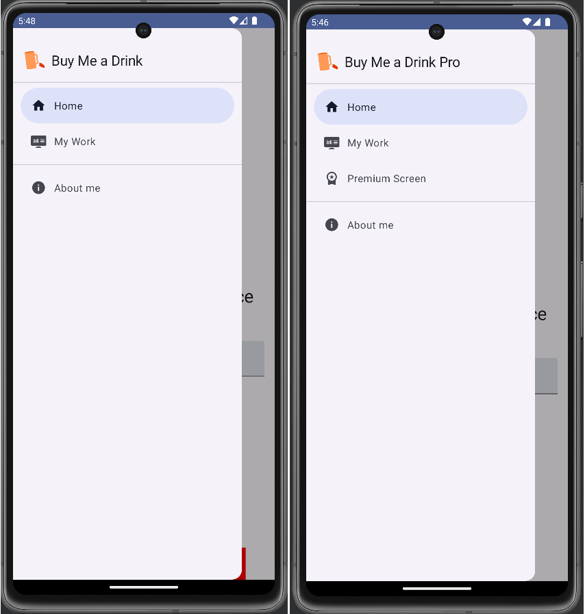
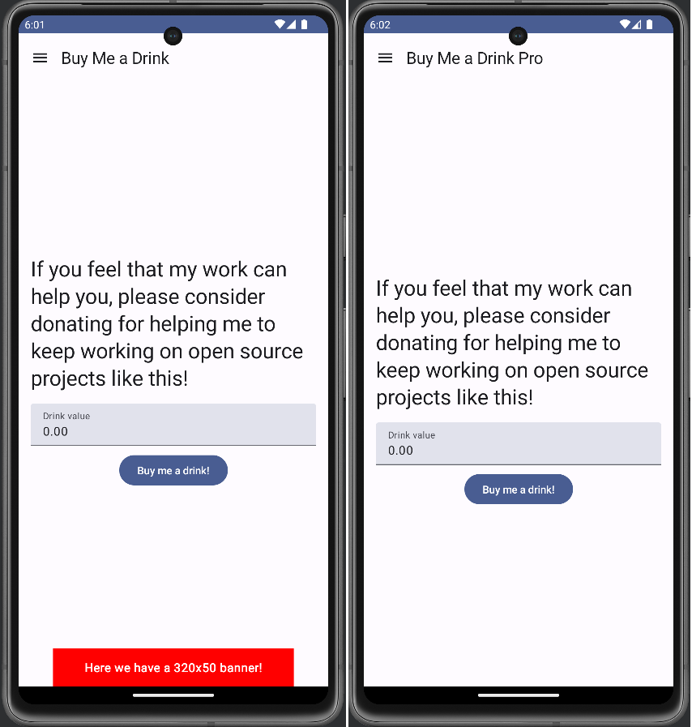
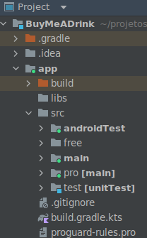
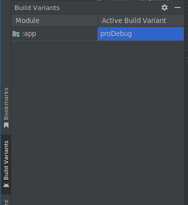

# Buy Me A Drink Sample App

This is a sample application with tests I've made while trying to learn to create an app with different product
flavors.

The approach used here was to simulate two common needs of a free/pro app flavors implementation:

- Provide a free version with adds
- Provide a pro version with special enhanced features





## How to Work with the different flavors

First create the different project directories for the chosen flavors (in this sample, free and pro):



Use the project view in the project tab instead of the Android default view in order to create the 
different directories.

Then [configure the flavors](https://developer.android.com/studio/build/build-variants#product-flavors) by editing the `app\build.gradle.kt` file and 
adding the required configurations inside the `android` section:

```kotlin

flavorDimensions += "version"
productFlavors {
    create("free")
    create("pro") {
        applicationIdSuffix = ".pro"
    }
}

```

Note that the **pro** version of this sample app has an own application id allowing both the free and the pro versions to be
delivered through the Google Play Store at the same time.

With the flavors created and configured, in order to work with the flavors in the **Android** view of the
**Project tab** of the Android Studio, use the **Build Variants tab** to switch between the flavors during
the development process:



The shared code between the flavors goes into the `main` source set while the specific code of each flavor
inside each specific source set. Try to draw the architecture of the app in a way that you put in the flavor
source set just the small amount of code that is necessary to differentiate the flavors.

In this sample the main differences between the flavors are concentrated in the Home screen, the destinations and
NavHost code and also in the app icon and in some string entries. The premium screen code only exists on the *pro* 
flavor source set.

## Some notes on the resources used

- This app was built on [Material Design 3](https://m3.material.io/)
- The [Material 3 Navigation Drawer](https://developer.android.com/jetpack/compose/components/drawe) was promoted
recently as not experimental
- The [Material 3 Top Toolbar](https://m2.material.io/components/app-bars-top/android#using-top-app-bars) for 
[Android](https://developer.android.com/reference/kotlin/androidx/compose/material/package-summary#TopAppBar(kotlin.Function0,androidx.compose.ui.Modifier,kotlin.Function0,kotlin.Function1,androidx.compose.ui.graphics.Color,androidx.compose.ui.graphics.Color,androidx.compose.ui.unit.Dp))
is still [experimental](https://developer.android.com/reference/kotlin/androidx/compose/material3/package-summary#TopAppBar(kotlin.Function0,androidx.compose.ui.Modifier,kotlin.Function0,kotlin.Function1,androidx.compose.foundation.layout.WindowInsets,androidx.compose.material3.TopAppBarColors,androidx.compose.material3.TopAppBarScrollBehavior)) 
at the present moment
- [Android build configuration](https://developer.android.com/build)
- [Configure build variants](https://developer.android.com/build/build-variants#kts)

## License

This project is provided under [MIT License](https://github.com/fabio-blanco/kotlin-android-samples/blob/main/LICENSE)

### Attributions

The [work icon](app/src/main/res/drawable/work_svgrepo_com.xml) was created by Shannon E. Thomas and is available at
[svgrepo.com](https://www.svgrepo.com/svg/412124/work), its license is [CC Attribution License](https://www.svgrepo.com/page/licensing/#CC%20Attribution)


