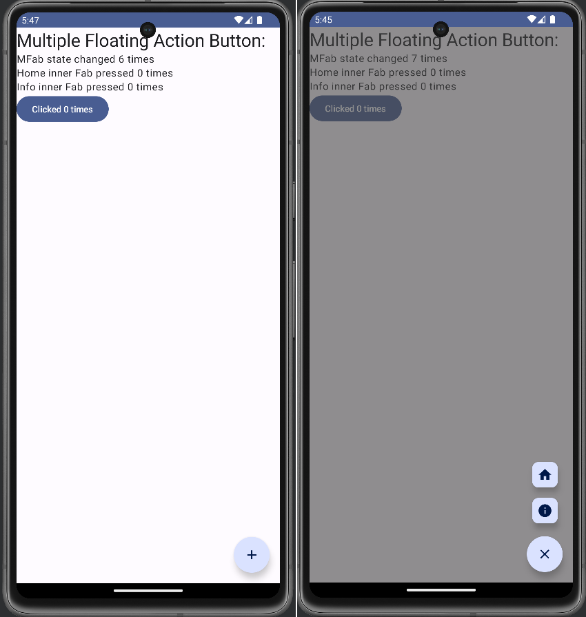

# Multiple Floating Action Button Sample - MultiFab App

This is a sample application with an implementation of a Multiple Fab ([Floating Action Button](https://developer.android.com/jetpack/compose/components/fab)) 
compose component.

For a simple example of the `MultiFloatingActionButton` component  take a look at the preview body at the end
of the `MultiFloatingActionButton.kt` file. For a more complete example of usage, take a look at the MainActivity
body.

A `listOfInnerFab` function helps creating the inner fab button items but the items can be created manually if
there is the need for more personalization of the button items.

Also a `rememberMFabState` function is available for creating the Multiple Fab state for a more direct control.

There is also a separated `ModalFabBackground` component to be optionally used in a [`Scaffold`](https://developer.android.com/jetpack/compose/components/scaffold) 
content for generating a transparent non-clickable background.

## License

This project is provided under [MIT License](https://github.com/fabio-blanco/kotlin-android-samples/blob/main/LICENSE)

